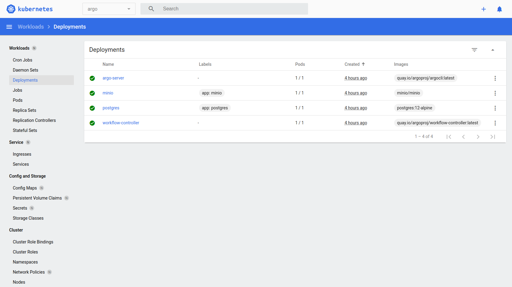
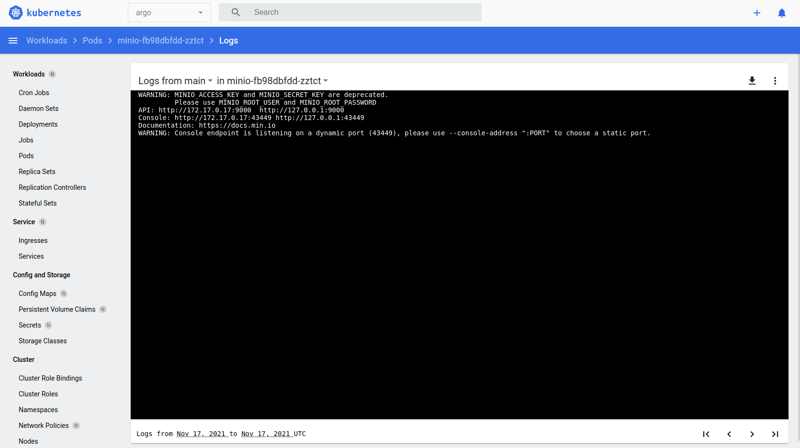
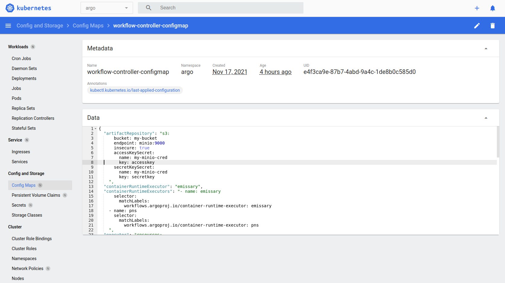

# Description
Biometric ArgosWorkflow based on qiime2

# Install minikube

# Install Argos Workflow

```shell
kubectl create ns argo
kubectl apply -n argo -f https://raw.githubusercontent.com/argoproj/argo-workflows/master/manifests/quick-start-postgres.yaml
```



# Access to Argos Workflow dashboard

Make a port-fordward of the argo-server port like this

```shell
kubectl -n argo port-forward deployment/argo-server 2746:2746
```

Open Argos Workflow dashboard Uri:

```shell
http://localhost:2746
```


# Access to Minio artifact repository

We could get open ports of Minio from Pod logs:

- Port 9000 is the Minio API Port
- Port 43449 is the Minio Console or Dashboard



Make a port-fordward of the minio console and API Minio published ports

```shell
kubectl -n argo port-forward deployment/minio 9000:43449
kubectl -n argo port-forward deployment/minio 9001:9000
```

Get Minio default credentials from Argos Workflow Minio secrets


Open Minio Dashboard

```shell
http://localhost:9000
```


# Argos Workflow artifact repository configuration
By default Argos Workflow used a S3 repository like artifact repository and the configuration is saved on the kubernetes config map called workflow-controller-configmap in the attribute called artifactRepository like this

