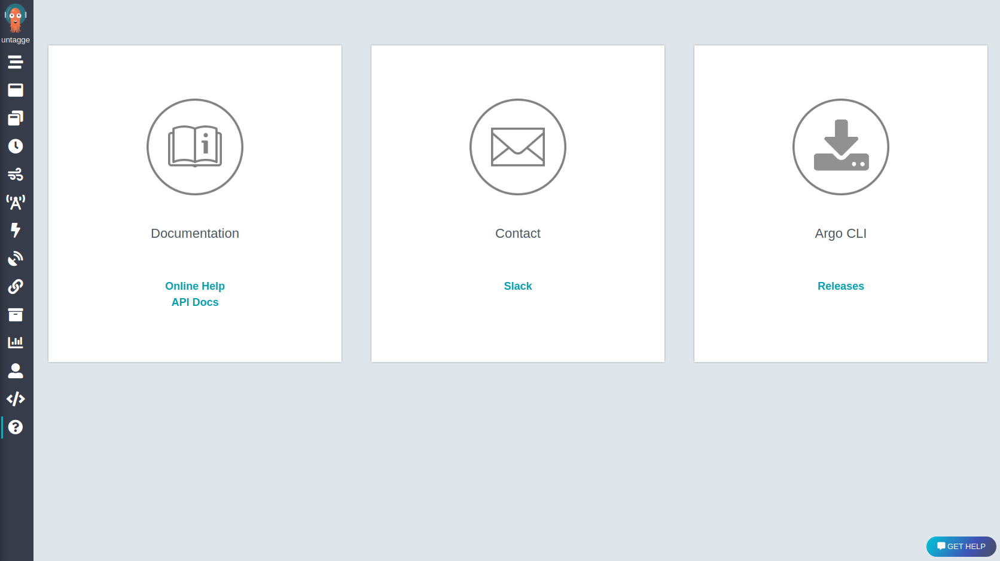
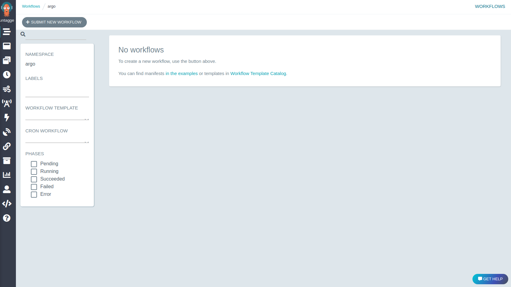
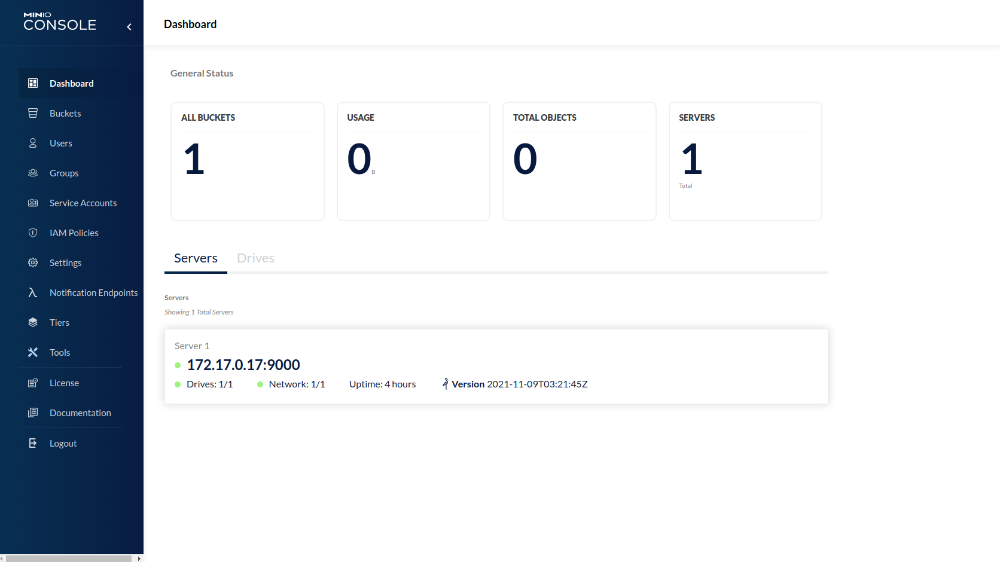
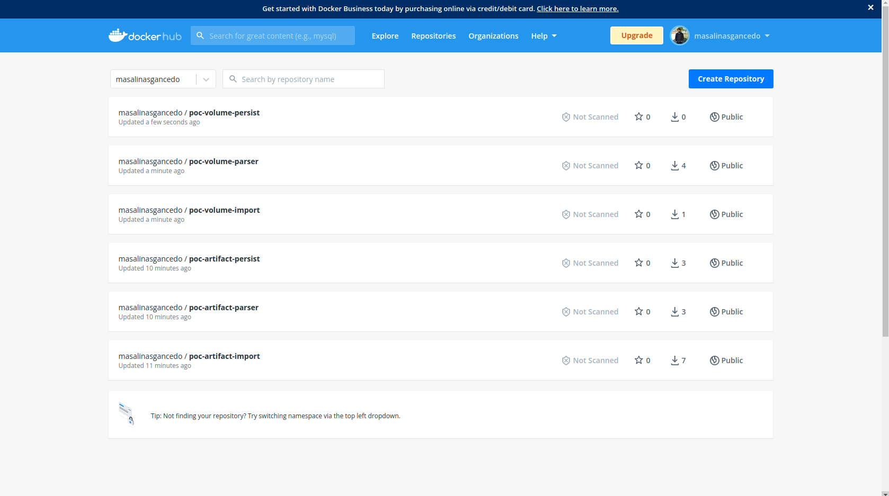
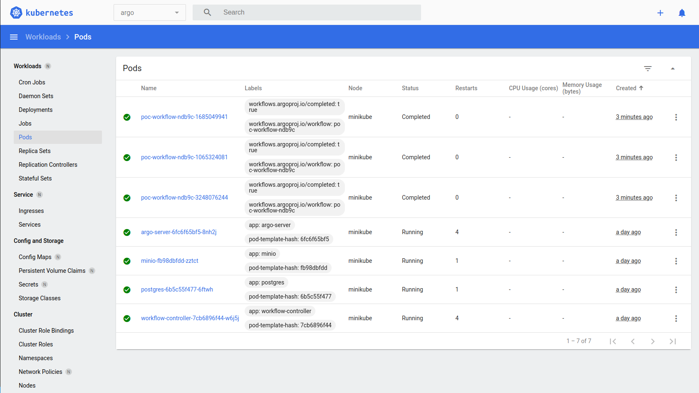
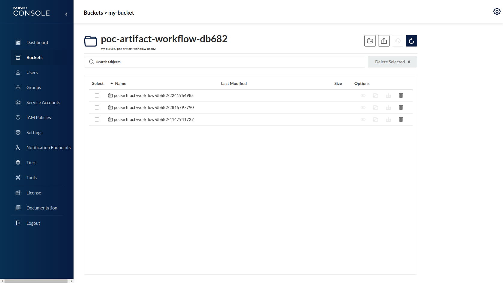
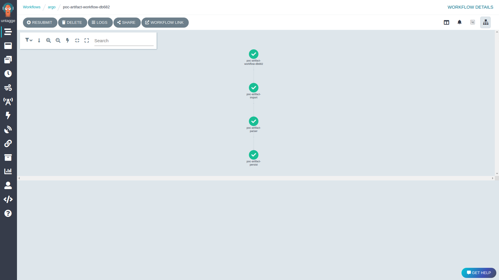
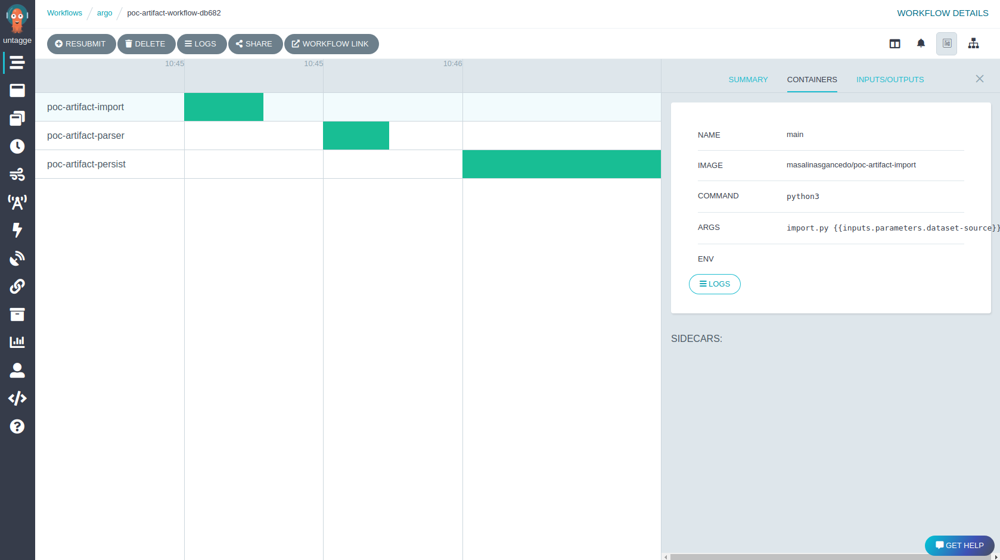
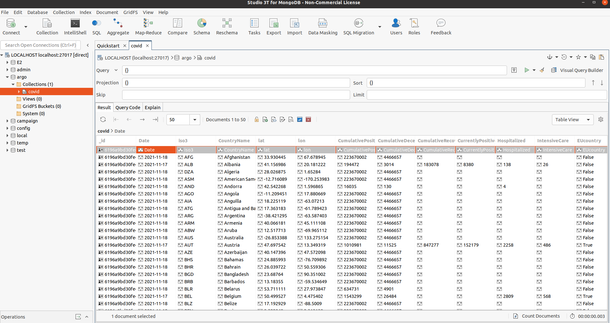

# Description
Argo Workflow PoC based on Python templates. 

We resolve the PoC following two architecture modes:

- Pass data between **artifacts**, creating folders inside artifact repository in Minio. 
- Pass data between ephemeral **volumes** attached to all templates

# Install and start Minikube

```shell
curl -LO https://storage.googleapis.com/minikube/releases/latest/minikube-linux-amd64
sudo install minikube-linux-amd64 /usr/local/bin/minikube

minikube start
```

# Install Kubernetes CLI

```shell
curl -LO "https://dl.k8s.io/release/$(curl -L -s https://dl.k8s.io/release/stable.txt)/bin/linux/amd64/kubectl"
sudo install -o root -g root -m 0755 kubectl /usr/local/bin/kubectl

kubectl version --client
```

# Install Argo Workflow in Kubernetes

```shell
kubectl create ns argo
kubectl apply -n argo -f https://raw.githubusercontent.com/argoproj/argo-workflows/master/manifests/quick-start-postgres.yaml
```


# Install Argo Workflow CLI

From Argo WorkFlow Dashboard we could download the CLI



The install binary

```shell
curl -sLO https://github.com/argoproj/argo-workflows/releases/download/v3.2.4/argo-linux-amd64.gz

gunzip argo-linux-amd64.gz

chmod +x argo-linux-amd64

mv ./argo-linux-amd64 /usr/local/bin/argo

argo version
```

chmod +z 
# Access to Argo Workflow dashboard

Make a port-fordward of the argo-server port like this

```shell
kubectl -n argo port-forward deployment/argo-server 2746:2746
```

Open Argo Workflow dashboard Uri:

```shell
http://localhost:2746
```



# Access to Minio artifact repository

We could get Argo Workflow open ports from Minio Pod logs. Minio export two ports:

- Port 43449 is the Minio Console or Dashboard (Be careful this port change when start Minikube so we must check it from Minio Pod Logs before)
- Port 9000 is the Minio API Port


Make a port-fordward of the minio console and API Minio published ports

```shell
kubectl -n argo port-forward deployment/minio 9000:43449
kubectl -n argo port-forward deployment/minio 9001:9000
```

Get Minio default credentials from Argo Workflow Minio secrets


Open Minio Dashboard

```shell
http://localhost:9000
```



# Argo Workflow artifact repository configuration

By default Argo Workflow used a S3 repository like artifact repository and the configuration is saved on the kubernetes config map called workflow-controller-configmap in the attribute called artifactRepository like this


If you want upload any file to Minio outside Kubernetes using Python we could use minio python package and the default Argo Workflow minio bucket

```Python
ARGO_BUCKET = "my-bucket"
DATA_FILENAME: "gas.csv"

# Connect to Minio in insecure mode using default Argo Workflow Minio credentials
client = Minio("localhost:9001", access_key="admin", secret_key="password", secure=False) 

# Make 'my-bucket' bucket if not exist.
found = client.bucket_exists(ARGO_BUCKET)

if not found:
    client.make_bucket(ARGO_BUCKET)
else:
    print("Bucket " + ARGO_BUCKET + " already exists")

# upload sample data to bucket
client.fput_object(ARGO_BUCKET, DATA_FILENAME, DATA_FILENAME)
```

# Deploy Argo Worlflow Templates

To execute the Workflow we must to pass a paramater called dataset-source where the obtain the data to we executed by the workflow
```Shell
Using argo workflow artifact architecture

argo -n argo submit --watch poc-artifact-workflow.yaml -p dataset-source="https://raw.githubusercontent.com/ec-jrc/COVID-19/master/data-by-country/jrc-covid-19-countries-latest.csv"

Using argo workflow volume architecture

argo -n argo submit --watch poc-volume-workflow.yaml -p dataset-source="https://raw.githubusercontent.com/ec-jrc/COVID-19/master/data-by-country/jrc-covid-19-countries-latest.csv"
```

- Docker Hub Argo Workflow Template Containers



- Pods created by Argo Workflow in Kubernetes



- Minio Bucket folders created by the Argo Workflow



- Argo Workflow executed





- Result sample persisted in MongoDB

